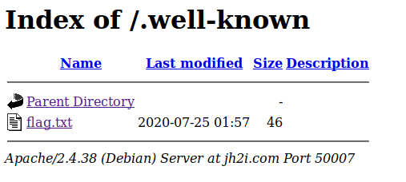
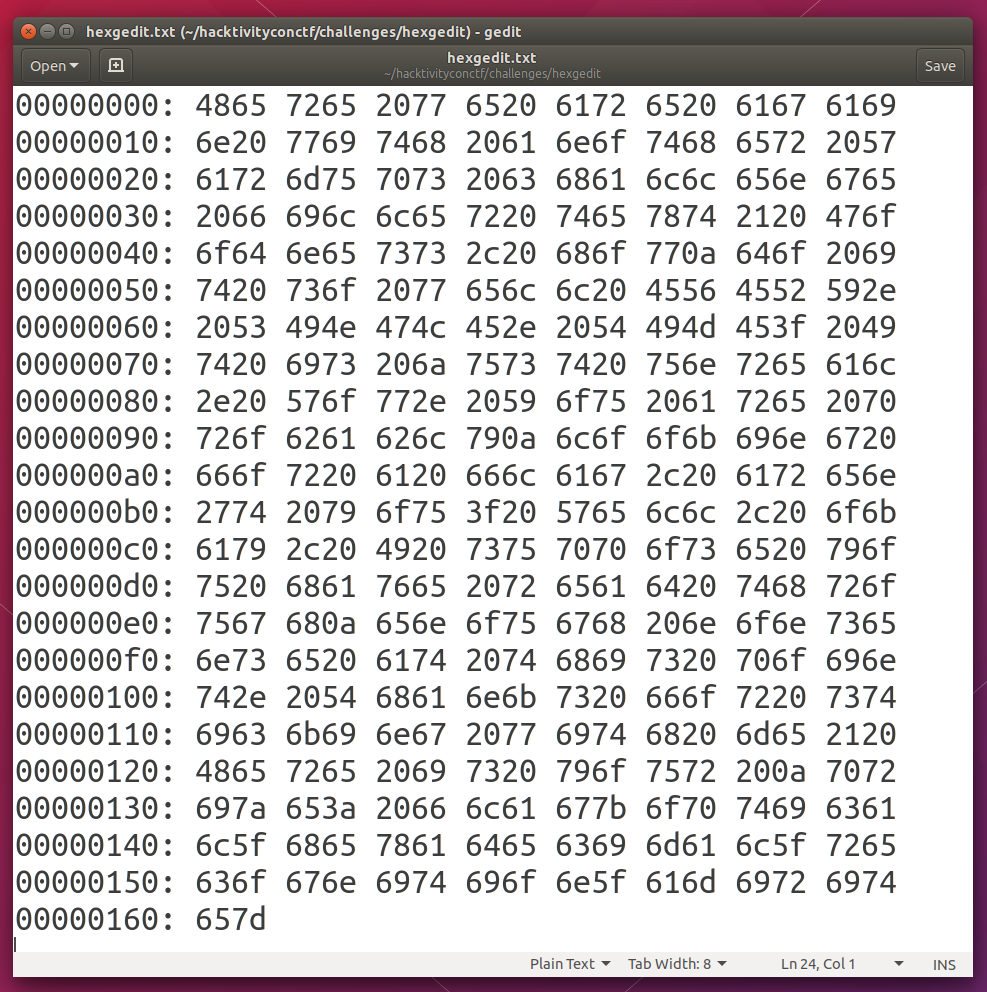

# HacktivityCon 2020 Write Ups

- [HacktivityCon 2020 Write Ups](#hacktivitycon-2020-write-ups)
- [crypto](#crypto)
  - [Tyrannosaurus Rex](#tyrannosaurus-rex)
- [mobile](#mobile)
  - [Mobile One](#mobile-one)
- [steganography](#steganography)
  - [Busted](#busted)
  - [Cold War](#cold-war)
  - [Spy vs Spy](#spy-vs-spy)
  - [Unsubscribed](#unsubscribed)
- [Warmups](#warmups)
  - [Caesar Mirror](#caesar-mirror)
  - [Well Known](#well-known)
  - [Hexgedit](#hexgedit)
  - [Internet Cattos](#internet-cattos)
  - [Vimdecrypt](#vimdecrypt)
  - [Spaghetti](#spaghetti)

# crypto

## Tyrannosaurus Rex

### Flag

```
flag{tyrannosauras_xor_in_reverse}
```

### Analysis & Solution

#### TL; DR;

Code to perform the decryption can be found [here](crypto/100_tyrannosaurus_rex/fossil)

#### Complete Analysis

We're given a [python file](crypto/100_tyrannosaurus_rex/fossil)

```
$ file fossil 
fossil: Python script, ASCII text executable, with CRLF line terminators
```

When we open it, we see that there is an `enc` function, and the `c` cipher obtained from running that function.

The method basically performs a XOR operation between the chars of the flag in a contiguously form:

xor[0] = flag[0] ^ flag[1]
...
xor[len(flag)] = flag[len(flag)] ^ flag [0] (Uses modulus to go around, so to xor last char with the first one)

To decode it, we basically need to do the same steps but in reverse:

First we run the `unhexlify` method to the cipher:

```python
In [6]: unhex_c = binascii.unhexlify(cipher)
In [7]: unhex_c                                              
Out[7]: b'7\x15\x102iGDU=\x12"\n\x0fXC\x15QtwR\x0e+<"k[\x1e\x15\x0fUI\x12\x0eU@#\x02\x026\x0f\r "\n7l\x00g'
```

From there we build the array with the corresponding encoding number for each part of the cipher:

```python
In [8]: xored_c = [unhex_c[i] for i in range(len(unhex_c))]
In [9]: xored_c                                                      
Out[9]: 
[55, 21, 16, 50, 105, 71, 68, 85, 61, 18, 34, 10, 15, 88, 67, 21, 81, 116, 119, 82, 14, 43, 60, 34, 107, 91, 30, 21, 15, 85, 73, 18, 14, 85, 64, 35, 2, 2, 54, 15, 13, 32, 34, 10, 55, 108, 0, 103]
```

If we look at the initial numbers and the final one, it matches to (what we already suspected) the format that the decoded cipher will be: `flag{ ... }`
(Try encoding a dummy flag, and you'll  be able to see the same)

So we can safely assume that the last char will be `}` and therefore a `61`. 

```python
In [10]: flag_bytes = [i for i in range(len(xored_c))]
In [11]: flag_bytes[-1] = 61
```

This will be very useful since we need to go xoring the chars but from the end instead of from the beginning (like it was ciphered initially).


```python
In [13]: i = len(flag_bytes) - 2
In [14]: while i >= 0: 
    ...:         flag_bytes[i] = xored_c[i] ^ flag_bytes[i+1] 
    ...:         i -= 1 
    ...:
In [15]: flag_bytes                                                   
Out[15]: 
[90, 109, 120, 104, 90, 51, 116, 48, 101, 88, 74, 104, 98, 109, 53, 118, 99, 50, 70, 49, 99, 109, 70, 122, 88, 51, 104, 118, 99, 108, 57, 112, 98, 108, 57, 121, 90, 88, 90, 108, 99, 110, 78, 108, 102, 81, 61, 61]
```

Now we have the flag bytes and just need to join and decode them:
```python
In [16]: encoded_flag = bytes(flag_bytes)
In [17]: flag = base64.b64decode(encoded_flag)
In [18]: flag                      
Out[18]: b'flag{tyrannosauras_xor_in_reverse}'
```

And there it is!
```
flag{tyrannosauras_xor_in_reverse}
```

# mobile

## Mobile One

### Flag

```
flag{strings_grep_and_more_strings}
```

### Analysis & Solution

Searching for *strings* to the given [apk file](mobile/50_mobile_one/mobile_one.apk) was enough to see the flag

```
$ strings mobile_one.apk | grep flag
##flag{strings_grep_and_more_strings}
```

# steganography

## Busted

### Flag

```
flag{compress_embedded_data}
```

### Analysis & Solution

We are given an [image file](steganography/50_busted/gal_chapman_031-300x234.jpg)

Using common tools like strings, binwalk, stegsolve, exiftool don't give any information.

However, when we analyze the file with *steghide* we see that there is something hidden with a passphrase:

```
$ steghide info gal_chapman_031-300x234.jpg 
"gal_chapman_031-300x234.jpg":
  format: jpeg
  capacity: 1.8 KB
Try to get information about embedded data ? (y/n) y
Enter passphrase: 
steghide: could not extract any data with that passphrase!
```

The question is where is that passphrase... After using several stegotools, I started from the beginning with this new information that I was looking for a password.

Finally I saw something strange when using *exiftool*:

```
ExifTool Version Number         : 12.00
File Name                       : gal_chapman_031-300x234.jpg
Directory                       : .
File Size                       : 33 kB
File Modification Date/Time     : 2020:07:29 19:55:45-07:00
File Access Date/Time           : 2020:08:04 13:38:54-07:00
File Inode Change Date/Time     : 2020:07:29 19:56:11-07:00
File Permissions                : rw-r--r--
File Type                       : JPEG
File Type Extension             : jpg
MIME Type                       : image/jpeg
JFIF Version                    : 1.01
Resolution Unit                 : None
X Resolution                    : 1
Y Resolution                    : 1
Comment                         : ctrl+alt+e
Image Width                     : 300
Image Height                    : 234
Encoding Process                : Baseline DCT, Huffman coding
Bits Per Sample                 : 8
Color Components                : 3
Y Cb Cr Sub Sampling            : YCbCr4:2:0 (2 2)
Image Size                      : 300x234
Megapixels                      : 0.070
```

There was a comment... Could this be the passphrase?

```
$ steghide extract -sf gal_chapman_031-300x234.jpg 
Enter passphrase: ctrl+alt+e
wrote extracted data to "flag.txt".
```

Jackpot! Flag.txt file extracted with the flag:

```
flag{compress_embedded_data}
```


## Cold War

### Flag

```
flag{do_not_use_merriam_webster}
```

### Analysis & Solution

When inspecting the [given txt file](steganography/50_cold_war/cold_war.txt), we see that after the first line that has some text, there are many "empty lines"

Upon selection, we can see that there is a combination of white spaces and tabs. This is known as *Whitespace Steganography*

In order to find the hidden flag we can use **stegsnow**

```
$ cat cold_war.txt | stegsnow -C
flag{do_not_use_merriam_webster}
```

## Spy vs Spy

### Flag

```
flag{two_MAD_spies}
```

### Analysis & Solution

Inspecting the [given image file](steganography/50_spy_vs_spy/spy_vs_spy.png) with a tool like **Stegsolve** and circling through the different panes, we'll find the flag at the [*red pane 0*](steganography/50_spy_vs_spy/red_pane_stego.png)

## Unsubscribed

### Flag

```
flag{hidden_message_in_spam}
```

### Analysis & Solution

When we open the [txt file](steganography/150_unsuscribed/email.txt), at first there is nothing that stands out (no white spacing, no chars encoded differently, etc.)

However, when looking closely to it, we start to see a certain pattern that is repeated. We can break the text in different "emails" that start with "Dear ..." and finishes with something like "Thanks/God Bless" etc.

It seems like the text is "repeating" the spam emails in different chunks.

If we look for "alternative" ways to hide messages, and combine it with the fact that we are repeating text basically, we'll end up finding [*Spammimic*](https://www.spammimic.com/encode.shtml); which basically takes a given text and then "encodes" it using spam text (brilliant!)

We can decode the text using that app, which will end up giving us the flag:

```
flag{hidden_message_in_spam}
```

# Warmups

## Caesar Mirror

### Flag

```
flag{julius_in_a_reflection}
```

### Analysis & Solution

When we open the [file](warmups/20_caesar_mirror/caesarmirror.txt) we see a classic rot13 cipher (also the level name is a hint towards that)

After doing the reverse action, we see the following:

```
     Oh boy! Wow, this warmup challenge sure   os I !rehtegot tup ot nuf fo tol a saw 
    definitely absolutely always love trying   sgniht evitavonni dna wen pu kniht ot 
       to do with the very basic, common and   fo trap tsrif ehT !seuqinhcet FTC cissalc 
     your flag is flag{julius_ and that is a   gnihtyreve ton si ti tub trats taerg 
```

So half of the text is reversed! After reversing it and placing it all together you get the complete message:

```
     Oh boy! Wow, this warmup challenge sure was a lot of fun to put together! I so
    definitely absolutely always love trying to think up new and innovative things
       to do with the very basic, common and classic CTF techniques! The first part of
     your flag is flag{julius_ and that is a great start but it is not everything
 that you will need to solve this challenge. I don't like trying to hide and 
  separate each part of the flag. The second part of the flag is _in_a_ but you do
   need just a little bit more. What exactly should we include here to try and make
     this filler text look more engaging and worthwhile? Should we add newlines?
    Should we add spaces and try and make it symmetrical? How many lines is enough
 to make this filler text look believable? A solid square of letters within a 
 simple, monospace-font text file looks good enough to me. Are we almost at the
   end? It looks like it! I hope it is good. The third part of your flag is reflection}
and at this point you should have everything that you need to submit this flag for
    points. The beginning is marked with the flag prefix and the opening curly brace,
  and it includes English words separated by underscores, to end in a closing curly
  brace. Wow! Now THAT is a CTF! Who knew we could milk the caesar cipher to this
            extent?? Someone get that Julius Caesar guy a medal!
```

And we can then build the flag that is splitted in 3:
1) flag{julius_
2) _in_a_ (reversed: _a_ni_)
3) reflection} (reversed: }noitcelfer)

Content has a typo (only one _ between julius and in)

```
flag{julius_in_a_reflection}
```

## Well Known

### Flag

```
flag{rfc5785_defines_yet_another_common_place}
```

### Analysis & Solution

The challenge has the following description:

```
asd7138: can you find the flag here?
tcm3137: no, i dont see it
jwh8163: i cant find it either
rfc5785: i found it
asd7138: what!? where?!
jwh8163: tell us!

Connect here:
http://jh2i.com:50007 
```

If we go to the url given and start doing a general inspection of it, we won't be able to find anything (source code, network request, html, etc)

So we need to go back to the hint. Who is the one that found it? **rfc5785**. Hmmm, sounds like RFC, right?

If we search for rfc5785, we'll indeed arrive to the [RFC for Defining Well-Known Uniform Resource Identifiers (URIs)](https://tools.ietf.org/html/rfc5785)

After reading it, we now know that */.well-known/* can have more information of the url (similar to */robots.txt*).

So, we connect again to the url but going to the */.well-known/* path, and bingo, we found a *flag.txt* in the directory, which contains the flag




```
flag{rfc5785_defines_yet_another_common_place}
```

## Hexgedit

### Flag

```
flag{optical_hexadecimal_recognition_amirite}
```

### Analysis & Solution

The given image has a gedit open with hex content.



We can parse it manually... But we can also delegate this task to something like OCR (Optical Character Recognition)

After using [OCR Tool](https://www.onlineocr.net/es/), and cleaning a little bit the parsed text, we're left with the following hex content:

```
4865 7265 2077 6520 6172 6520 6167 6169 6e20 7769 7468 2061 6e6f 7468 6572 2057 6172 6d75 7073 2063 6861 6c6c 656e 6765 2066 696c 6c65 7220 7465 7874 2120 476f 6f64 6e65 7373 2c20 686f 770a 646f 2069 7420 736f 2077 656c 6c20 4556 4552 592e 2053 494e 474c 452e 2054 494d 453f 2049 7420 6973 206a 7573 7420 756e 7265 616c 2e20 576f 772e 2059 6f75 2061 7265 2070 726f 6261 626c 790a 6c6f 6f6b 696e 6720 666f 7220 6120 666c 6167 2c20 6172 656e 2774 2079 6f75 3f20 5765 6c6c 2c20 6f6b 6179 2c20 4920 7375 7070 6f73 6520 796f 7520 6861 7665 2072 6561 6420 7468 726f 7567 680a 656e 6f75 6768 206e 6f6e 7365 6e73 6520 6174 2074 6869 7320 706f 696e 742e 2054 6861 6e6b 7320 666f 7220 7374 6963 6b69 6e67 2077 6974 6820 6d65 2120 4865 7265 2069 7320 796f 7572 200a 7072 697a 653a 2066 6c61 677b 6f70 7469 6361 6c5f 6865 7861 6465 6369 6d61 6c5f 7265 636f 676e 6974 696f 6e5f 616d 6972 6974 657d 
```

That it can be translated to:
```
Here we are again with another Warmups challenge filler text! Goodness, how
do it so well EVERY. SINGLE. TIME? It is just unreal. Wow. You are probably
looking for a flag, aren't you? Well, okay, I suppose you have read through
enough nonsense at this point. Thanks for sticking with me! Here is your 
prize: flag{optical_hexadecimal_recognition_amirite}
```

## Internet Cattos

### Flag

```
flag{this_netcat_says_meow}
```

### Analysis & Solution

Description of the challenge is:
```
The Internet is full of wonderful kittens and cattos. You can even find one at jh2i.com on port 50003!
```

When connecting to the given address, we see the following:
```
$ nc jh2i.com 50003
Oh, we already sent the flag! Did you see it?
```

So, probably the flag is being encoded in some way that cannot be printed.

Using the python pwn lib, we can inspect it:
```
In [1]: from pwn import remote                                                     
In [2]: conn = remote("jh2i.com", 50003)                                           
[x] Opening connection to jh2i.com on port 50003
[x] Opening connection to jh2i.com on port 50003: Trying 104.197.242.66
[+] Opening connection to jh2i.com on port 50003: Done

In [3]: content = conn.read().strip().decode('utf-8')                                 

In [4]: content                                                                     
Out[5]: 'f\rl\ra\rg\r{\rt\rh\ri\rs\r_\rn\re\rt\rc\ra\rt\r_\rs\ra\ry\rs\r_\rm\re\ro\rw\r}\rOh, we already sent the flag! Did you see it?'

```

And there it was, all chars of the flag were appended with a \r char

```
flag{this_netcat_says_meow}
```

## Vimdecrypt

### Flag

```
flag{sometimes_it_really_do_be_like_that_tho}
```

### Analysis & Solution

When we open the [vencrypted.txt](warmups/40_vencryption/vencrypted.txt) file we see the following:

```
VimCrypt~03!���r\vܛ�n�,��8)ִ��,Z��8o���z��c�F{6� �%"�aucѫ��
```

Between the challenge title and how the file content begins, we see that it is a VIM encrypted file.

There is already a really neat tool called [vimdecrypt](https://github.com/nlitsme/vimdecrypt) that can be used to decrypt these kind of files.

Before using bruteforce, we can try using a dictionary attack with the *rockyou* wordllist:

```
$ python vimdecrypt.py --dictionary rockyou.txt vencrypted.txt
probable password: computer
---------
flag{sometimes_it_really_do_be_like_that_tho}

---------
```

And there we have it!

## Spaghetti

### Flag

```
flag{wow_that_was_a_long_string_of_spaghetti}
```

### Analysis & Solution

We are given a [png file](warmups/50_spaghetti/spaghetti.png). This seems like a stego challenge.

After several attempts with different tools (stegsolve, steghide, strings, etc), I used binwalk to see if it was hiding anything else:

```
$ binwalk -e spaghetti.png 

DECIMAL       HEXADECIMAL     DESCRIPTION
--------------------------------------------------------------------------------
0             0x0             PNG image, 520 x 300, 8-bit/color RGBA, non-interlaced
59            0x3B            Zlib compressed data, best compression
```

We see there is a Zlib there. Usually it's nothing, but we can give it a try and inspect it to check if the flag is there.

Using a tool like [FileExt](https://filext.com), we can upload it and analyze it. And the flag was actually there:

```
 BIIIIIII) JJJJJJJJ PRRRRRRR
 BIIIIIII) JJJJJJJJ PRRRRRRR
 BIIIIIII) JJJJJJJ
À x2wP?9f83*~
Œ¯ o3xb e2 v>^F82V
 _O`vQ ^yFLsp
× 6o*vn5Lv=u
 tEXtSoftware Adobe ImageReadyq
 flag{wow_that_was_a_long_string_of_spaghetti}
 ```